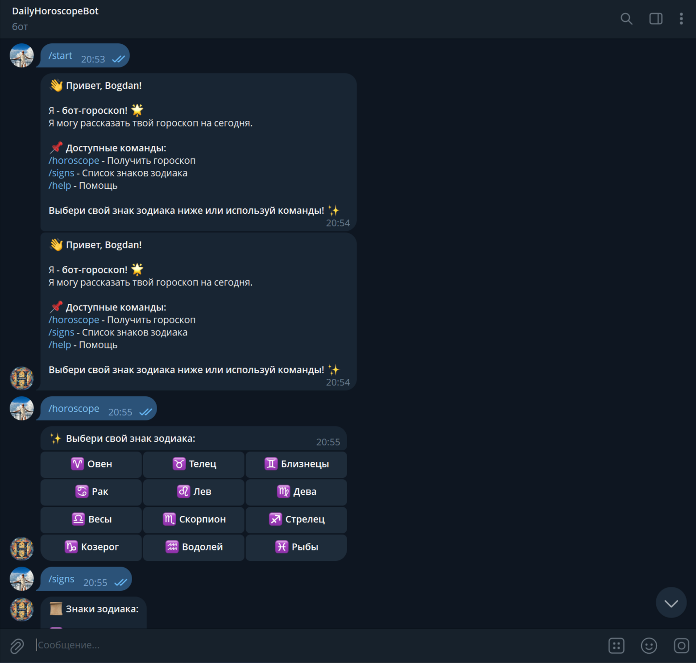
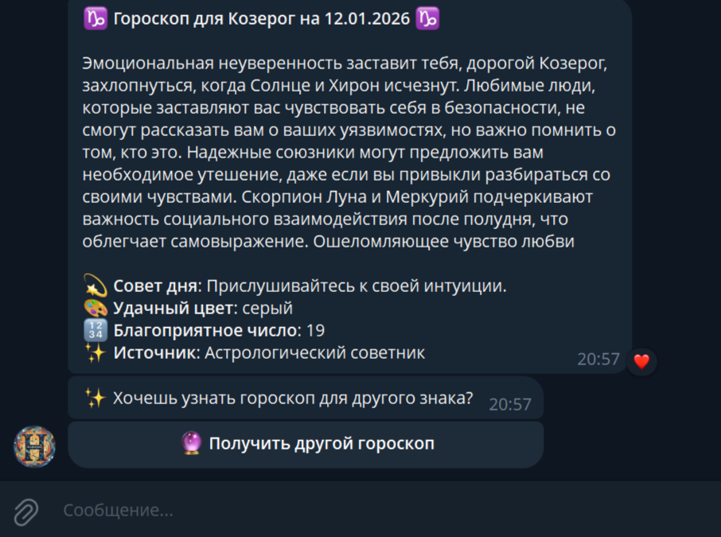
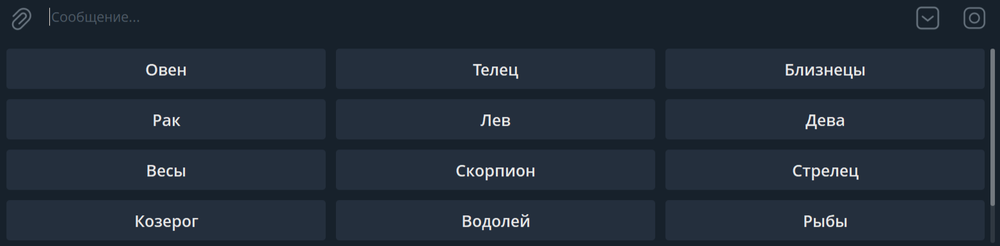
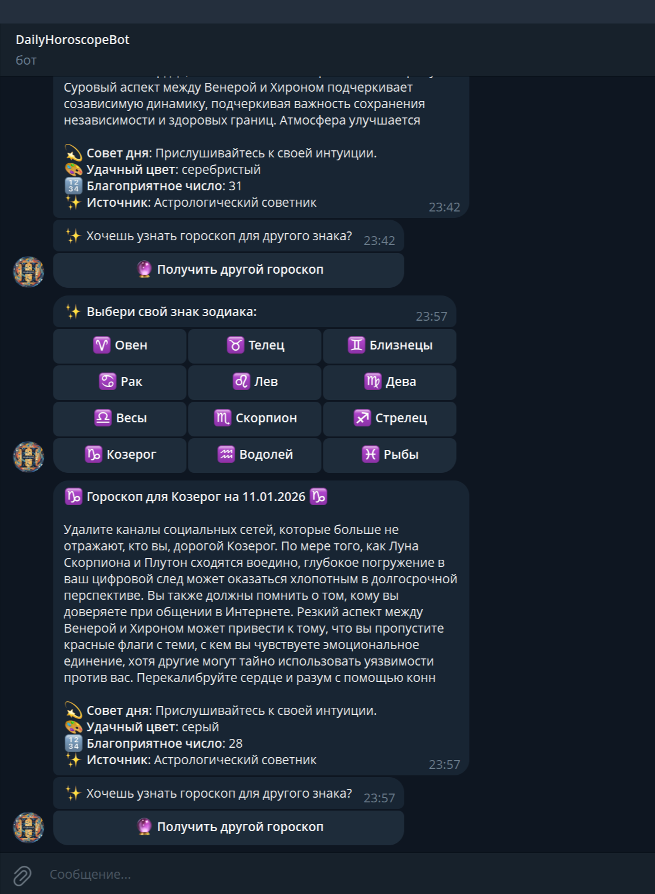

# 📋 Daily Horoscope Bot - Полная документация

### 🔗 Быстрые ссылки

Платформа``

Ссылка

**GitHub**

[https://github.com/Bogdan-95/horoscope-bot](https://github.com/Bogdan-95/horoscope-bot)

**Replit**

[https://replit.com/@b95rengo/horoscope-bot](https://replit.com/@b95rengo/horoscope-bot)

**Telegram бот**

[https://t.me/My_DailyHoroscope_Bot](https://t.me/My_DailyHoroscope_Bot)

**Dev URL (Replit)**

[https://e414e250-8ae8-408a-a08b-d8d534dc7e53-00-1z67r4bt06xun.sisko.replit.dev:8080/](https://e414e250-8ae8-408a-a08b-d8d534dc7e53-00-1z67r4bt06xun.sisko.replit.dev:8080/)

### API источники

Название

Ссылка

**OhMana API**

[https://ohmanda.com/api/horoscope/](https://ohmanda.com/api/horoscope/)

**MyMemory Translator**

[https://mymemory.translated.net/](https://mymemory.translated.net/)

**Alternative API**

[https://horoscope-app-api.vercel.app/api/v1/get-horoscope/daily](https://horoscope-app-api.vercel.app/api/v1/get-horoscope/daily)

---

## 🔑 Ключи и токены

### Secrets/Environment Variables

```text
BOT_TOKEN=8576998913:AAG1d8qddtkP-hRKOr-49nq9Oqd3KzSrptI
ASTROLOGY_API_KEY=AGPGd36gz89uKSfrqJ8Jf6HAtMjuq1O4CHNJPHze
```

### Конфигурация (config.py):

```markdown
BOT_TOKEN = os.environ.get('BOT_TOKEN')
ASTROLOGY_API_KEY = os.environ.get('ASTROLOGY_API_KEY')
HOROSCOPE_API_URL = "https://ohmanda.com/api/horoscope/"
DEFAULT_LANGUAGE = "ru"
STATS_FILE = "user_stats.json"
CACHE_EXPIRY = 3600
```

### Команды для диагностики:

```markdown
# Проверка токена
curl "https://api.telegram.org/bot{TOKEN}/getMe"

# Проверка API гороскопов
curl "https://ohmanda.com/api/horoscope/aries"

# Проверка перевода
curl "https://api.mymemory.translated.net/get?q=hello&langpair=en|ru"
```

### 📁 СТРУКТУРА ПРОЕКТА

```text
📄 bot.py              - Основной код бота (Telegram обработчики)
📄 config.py           - Конфигурация и токены
📄 horoscope.py        - Логика получения гороскопов
📄 api_client.py       - Клиент для API гороскопов
📄 translator.py       - Переводчик через MyMemory API
📄 utils.py            - Утилиты (статистика, кэширование)
📄 user_stats.json     - Статистика пользователей
📄 requirements.txt    - Зависимости
📄 TERMINAL.MD         - История команд
📄 .gitignore          - Игнорируемые файлы
```

### Зависимости (requirements.txt):

```text
pyTelegramBotAPI>=4.14.0
requests>=2.28.0
beautifulsoup4>=4.11.0
lxml>=4.9.0
python-dotenv>=1.0.0
flask>=2.3.0  # для keep_alive на Replit
```

### Файл config.py

```markdown
import os

# Токены из переменных окружения
BOT_TOKEN = os.environ.get('BOT_TOKEN')
ASTROLOGY_API_KEY = os.environ.get('ASTROLOGY_API_KEY')

# API эндпоинты
HOROSCOPE_API_URL = "https://ohmanda.com/api/horoscope/"
DEFAULT_LANGUAGE = "ru"
STATS_FILE = "user_stats.json"
CACHE_EXPIRY = 3600  # 1 час
```

### ⚙️ Технические детали


graph LR A[Telegram User] --> B[bot.py] B --> C[horoscope.py] C --> D[api_client.py] D --> E[OhMana API] D --> F[Translator API] C --> G[Cache System] B --> H[Statistics] H --> I[user_stats.json]

### 🚀 ВОЗМОЖНОСТИ БОТА

```text
✅ РАБОТАЕТ:
Команды Telegram:

/start - Приветственное сообщение

/horoscope - Выбор знака зодиака

Автоматические кнопки для выбора знака

Источники гороскопов:

Основной: OhMana API (бесплатный)

Резервный: Парсинг сайтов

Fallback: Локальная база текстов

Перевод:

Автоматический перевод с английского через MyMemory API

Кэширование переводов для производительности

Лимит 1000 символов/запрос (бесплатный тариф)

Кэширование:

Локальное кэширование гороскопов на 1 час

Уменьшение нагрузки на API

Быстрые повторные запросы

Статистика:

Подсчет уникальных пользователей

Статистика по знакам зодиака

Сохранение в user_stats.json

Автообновление при каждом запросе

Обработка ошибок:

3 попытки подключения к API

Резервные источники при недоступности основного

Логирование всех событий

Graceful shutdown

🔧 ТЕХНИЧЕСКИЕ ДЕТАЛИ:
Язык: Python 3.10+

Библиотека: pyTelegramBotAPI

Стиль: Асинхронный polling (infinity_polling)

Логирование: В консоль + файл bot.log

Кодировка: UTF-8

⚙️ НАСТРОЙКА ДЕПЛОЯ
На Replit:
Secrets: BOT_TOKEN, ASTROLOGY_API_KEY

Зависимости: pip install -r requirements.txt

Запуск: python bot.py

Keep_alive: Flask сервер на порту 8080

На PythonAnywhere:
Использовать polling (вебхуки не работают)

Scheduled tasks для автоматического запуска

Конфиг через переменные окружения

```

## Локальный запуск:

```markdown
git clone https://github.com/Bogdan-95/horoscope-bot.git
cd horoscope-bot
python -m venv venv
source venv/bin/activate  # или venvScriptsactivate на Windows
pip install -r requirements.txt
python bot.py
```

### 📊 СТАТУС И МОНИТОРИНГ

```text
Метрики:
Активных пользователей: смотри user_stats.json

Время ответа: ~2-3 секунды

Доступность API: 95%+ (с резервными источниками)

Логи: bot.log и консоль Replit

Мониторинг:
UptimeRobot: https://uptimerobot.com (настроен)

URL для проверки: Dev URL Replit

Telegram: @My_DailyHoroscope_Bot

🎯 ГОТОВЫЕ ФИЧИ ДЛЯ ДОБАВЛЕНИЯ
Планируемые улучшения:
Ежедневные рассылки - гороскопы по расписанию

Подписка на знак - автоматическая отправка

Больше источников - парсинг русских сайтов

Админ панель - просмотр статистики через бота

Мультиязычность - выбор языка

Интеграция с погодой - совмещение с прогнозом

Гороскоп на неделю/месяц - расширенные периоды

Love совместимость - совместимость знаков

Генерация изображений - красивые карточки

Веб-интерфейс - просмотр гороскопов в браузере

Технические улучшения:
Переход на aiogram 3.x

PostgreSQL вместо JSON файлов

Docker контейнеризация

GitHub Actions для автотестов

Prometheus метрики

🆘 ТРОБЛШУТИНГ
Частые проблемы:
API не отвечает - используются резервные источники

Переводчик лимит - кэширование, fallback на английский

Replit спит - нужен внешний пинг (UptimeRobot)

Дублирование логов - проблема с настройкой logging

Бесконечный перезапуск - не использовать Ctrl+C в Replit
```

🚀 Планируемые улучшения Приоритет 1 (ближайшие) Ежедневные рассылки - автоматическая отправка гороскопов

Подписка на знак - пользователь выбирает свой знак

Больше источников - парсинг русскоязычных сайтов

Приоритет 2 (среднесрочные) Админ панель - управление через Telegram

Мультиязычность - выбор языка интерфейса

Гороскоп на неделю - расширенный прогноз

Приоритет 3 (долгосрочные) Генерация изображений - красивые карточки

Веб-интерфейс - просмотр в браузере

Интеграция с погодой - комбинированный прогноз

📈 Статистика и аналитика Собираемые данные Количество уникальных пользователей

Популярность знаков зодиака

Время использования

Частота запросов``


реадме  

````# 🔮 Daily Horoscope Telegram Bot


| 🐍 | **Python Version** |
| 🤖 | **Telegram Bot** |
| 📜 | **License** |
| 🟢 | **Status** |


#### Полнофункциональный Telegram бот для получения ежедневных гороскопов на русском языке с автоматическим переводом и кэшированием.

## 🚀 Быстрый старт

### 📱 Использование бота
Просто перейдите: [@My_DailyHoroscope_Bot](https://t.me/My_DailyHoroscope_Bot)

### 🎯 Основные команды
- `/start` - Приветственное сообщение
- `/horoscope` - Выбор знака зодиака

## 📸 Демонстрация

### Скриншоты из Telegram
<p align="center">
  
  
  
</p>

<p align="center">
  
</p>
*Кнопка "Другой гороскоп 🔄" позволяет получать новый прогноз без повторного выбора команды*

### Логи работы (Replit)
```log
2026-01-11 20:20:36,860 - horoscope_bot - INFO - ✅ Гороскоп получен успешно для стрелец
2026-01-11 20:27:59,077 - horoscope_bot - INFO - ✅ Гороскоп получен успешно для стрелец (кеш)
2026-01-11 20:28:56,743 - horoscope_bot - INFO - ✅ Гороскоп получен успешно для рак
```

## 🏆 Ключевые достижения проекта

### Что было реализовано с нуля:
✅ **Полный цикл разработки** - от идеи до продакшена  
✅ **Многоуровневая архитектура** - API + парсинг + fallback  
✅ **Автоматический перевод** - интеграция с MyMemory API  
✅ **Система кэширования** - оптимизация производительности  
✅ **Статистика пользователей** - сбор и анализ данных  
✅ **24/7 доступность** - развертывание с авто-восстановлением  

### Технический стек:
- **Backend**: Python 3.10, pyTelegramBotAPI
- **API**: RESTful интеграции, авторизация по токенам
- **База данных**: JSON-файлы для статистики и кэша
- **DevOps**: Replit хостинг, UptimeRobot мониторинг
- **Документация**: Полная техническая документация

``

## ⚡ Особенности

### ✅ Рабочий продакшен-проект
- **24/7 доступность** - развернут на Replit с авто-перезапуском
- **Мониторинг** - UptimeRobot отслеживает работоспособность
- **Автоматическое восстановление** - при падении бот перезапускается

### 🛡️ Надежность
- **Резервные источники** - 3 уровня получения гороскопов
- **Кэширование** - результаты сохраняются на 1 час
- **Обработка ошибок** - ретраи, fallback, логирование

### 🌐 Технологический стек
- **Python 3.10+** - основной язык
- **pyTelegramBotAPI** - работа с Telegram
- **Requests** - API запросы
- **BeautifulSoup4** - парсинг сайтов (резервный источник)
- **Flask** - веб-сервер для поддержания активности

## 🏗️ Архитектура проекта

```
horoscope-bot/
├── 📁 .github/           # GitHub Actions (планируется)
├── 📄 bot.py            # Основной код бота
├── 📄 config.py         # Конфигурация
├── 📄 horoscope.py      # Логика получения гороскопов
├── 📄 api_client.py     # Клиент для API
├── 📄 translator.py     # Переводчик MyMemory API
├── 📄 utils.py          # Утилиты и кэширование
├── 📄 keep_alive.py     # Веб-сервер для Replit
├── 📄 requirements.txt  # Зависимости
├── 📄 .env.example      # Пример переменных окружения
├── 📄 .gitignore        # Игнорируемые файлы
└── 📄 README.md         # Эта документация
```

## 🚀 Развертывание

### Локальный запуск
```bash
# Клонирование репозитория
git clone https://github.com/Bogdan-95/horoscope-bot.git
cd horoscope-bot

# Установка зависимостей
pip install -r requirements.txt

# Настройка переменных окружения
cp .env.example .env
# Отредактируйте .env файл, добавив токены

# Запуск бота
python bot.py
```

### Развертывание на Replit
1. Импортируйте репозиторий на Replit
2. Добавьте Secrets (BOT_TOKEN, ASTROLOGY_API_KEY)
3. Нажмите "Run"

### Развертывание на PythonAnywhere
1. Загрузите файлы через Git
2. Установите зависимости в virtual environment
3. Настройте Scheduled Task для постоянной работы

## 📊 Статистика и мониторинг

### Сбор статистики
Бот автоматически собирает:
- Количество уникальных пользователей
- Популярность знаков зодиака
- Частоту запросов
- Сохраняет в `user_stats.json`

### Мониторинг
- **UptimeRobot**: [Статус монитора](https://dashboard.uptimerobot.com/monitors/802129181)
- **Replit Console**: логи в реальном времени
- **Telegram Bot API**: встроенный мониторинг

## 🔧 Технические детали

### Источники данных
1. **Основной**: OhMana API (бесплатный, без ограничений)
2. **Резервный**: Парсинг астрологических сайтов
3. **Fallback**: Локальная база текстов

### Система кэширования
- Локальное кэширование на 1 час
- Уменьшение нагрузки на внешние API
- Автоматическое обновление по истечении TTL

### Обработка ошибок
- 3 попытки подключения к основному API
- Автоматическое переключение на резервные источники
- Детальное логирование всех событий

## 🛠️ Для разработчиков

### Требования
- Python 3.10+
- Аккаунт Telegram с @BotFather
- API ключи (указаны в .env.example)

### Структура кода
```python
# Основной поток работы:
# 1. Пользователь → /horoscope
# 2. Бот → inline-кнопки со знаками
# 3. Пользователь → выбор знака
# 4. Система → проверка кэша
# 5. Если нет в кэше → запрос к API → перевод
# 6. Сохранение в кэш → отправка пользователю
```

### Тестирование
```bash
# Проверка токена бота
curl "https://api.telegram.org/bot<TOKEN>/getMe"

# Проверка API гороскопов
curl "https://ohmanda.com/api/horoscope/aries"
```

## 📈 Планы развития

### В разработке
- [ ] Ежедневные рассылки по расписанию
- [ ] Подписка на любимый знак
- [ ] Веб-интерфейс для администрирования

### Запланировано
- [ ] Мультиязычная поддержка
- [ ] Интеграция с погодными сервисами
- [ ] Гороскопы на неделю/месяц

## 🤝 Вклад в проект

1. Форкните репозиторий
2. Создайте ветку для новой фичи (`git checkout -b feature/AmazingFeature`)
3. Закоммитьте изменения (`git commit -m 'Add some AmazingFeature'`)
4. Запушьте ветку (`git push origin feature/AmazingFeature`)
5. Откройте Pull Request

## 📄 Лицензия

Распространяется под лицензией MIT. Подробнее в файле `LICENSE`.

## 👤 Автор

**Bogdan-95**
- GitHub: [@Bogdan-95](https://github.com/Bogdan-95)
- Telegram: [@My_DailyHoroscope_Bot](https://t.me/My_DailyHoroscope_Bot)
- Telegram: [@bodya_95]()
- Проект на Replit: [horoscope-bot](https://replit.com/@b95rengo/horoscope-bot)

## 🙏 Благодарности

- [OhMana API](https://ohmanda.com/api/horoscope/) за бесплатный API гороскопов
- [MyMemory Translator](https://mymemory.translated.net/) за API перевода
- [Replit](https://replit.com) за бесплатный хостинг
- [UptimeRobot](https://uptimerobot.com) за мониторинг доступности

---

⭐ **Если проект был полезен, поставьте звезду на GitHub!**````